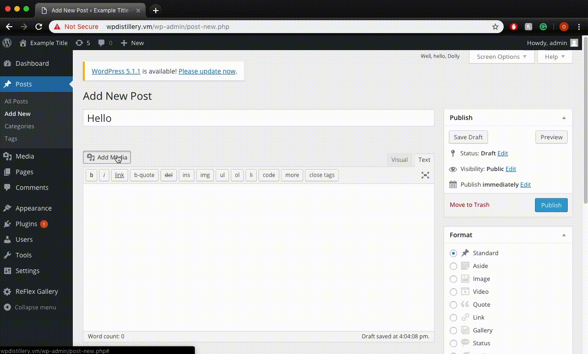

# Web-Security-CodePath-Week-7-8

Hello. 


4. (Optional) Stored Cross-Site Scripting
  - [x] Summary: A user with editing privileges can inject a script in a reply message which is executed when the mouse is hovered over the link.
    - Vulnerability types: XSS
    - Tested in version: 4.2
    - Fixed in version: 4.2.1
  - [x] GIF Walkthrough: 
  - [x] Steps to recreate:
  1. Using an account with editing privileges, make a reply with the following text:
  ```
  <a href = "" onmouseover=alert("Hi") >Click here</a>
  ```
  2. Once someone hovers there mouse over the link, the script will be ran.
  - [x] Affected source code:
    - [Link 1](https://core.trac.wordpress.org/browser/tags/4.2/src/wp-includes/comment-template.php)
5. (Optional) Cross-Site Scripting (XSS) via Media File Metadata
  - [x] Summary: A user can upload an audio file with meta data containing a script to be exectued once the audio file is added to a post's playlist
    - Vulnerability types: XSS
    - Tested in version: 4.2
    - Fixed in version: 4.2.13
  - [x] GIF Walkthrough: 
  - [x] Steps to recreate:
  1. Download the xss.mp3 audio file found at the bottom of this page: https://seclists.org/oss-sec/2017/q1/563
  Any audio file should work as long as its meta data is properly formatted to run the specified script.
  2. Create a new post and add the audio file to the post's playlist
  
  - [x] Affected source code:
    - [Link 1](https://github.com/WordPress/WordPress/commit/28f838ca3ee205b6f39cd2bf23eb4e5f52796bd7)
